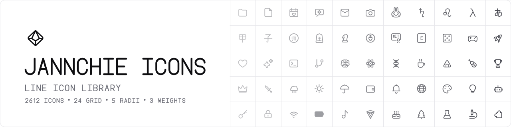

<p align="center">
  
</p>

<p align="center">
  <a href="https://icons.jannchie.com">Website</a> · <a href="README.zh-CN.md">中文</a>
</p>

Jannchie Icons is a line icon library of 1,800+ icons on a 24-unit grid. Corner radius and stroke weight are inputs to each icon's geometry, not CSS overrides: every icon is redrawn for the selected setting, so corners stay consistent at any radius, dots and fine details keep their proportions at heavier weights, and horizontal and vertical strokes land on whole pixels on HiDPI screens.

Besides the usual interface icons, the set covers symbol systems that general-purpose libraries rarely include: Hiragana and Katakana, Greek letters, Heavenly Stems and Earthly Branches, the Chinese zodiac, I Ching trigrams and hexagrams, runes, alchemical symbols, Maya numerals, music notation, xiangqi and shogi pieces, content rating marks, Creative Commons and license badges, and laundry care symbols.

## Usage

Open [icons.jannchie.com](https://icons.jannchie.com), choose a corner radius and a stroke weight, select an icon, and copy or download the SVG. The `heart` icon at radius 2, weight Regular:

```svg
<svg xmlns="http://www.w3.org/2000/svg" width="24" height="24" viewBox="0 0 24 24" fill="none" stroke="currentColor" stroke-width="1" stroke-linecap="round" stroke-linejoin="round">
  <path d="M12 20C9 18 3 14.5 3 9.25 3 6.5 5 4.5 7.5 4.5c2 0 3.5 1 4.5 2.5 1-1.5 2.5-2.5 4.5-2.5 2.5 0 4.5 2 4.5 4.75C21 14.5 15 18 12 20z"/>
</svg>
```

Exported SVGs use `currentColor`, so they inherit the surrounding text color. The preview site aligns every icon to the device pixel grid at its displayed size, so lines render crisply at any size and pixel density. The [Examples](https://icons.jannchie.com/?view=examples) view shows the icons in common interface components such as navigation, toolbars, file lists, and notifications, rendered with the current settings.

| Option | Values | Effect |
|---|---|---|
| Radius | Sharp, 0, 1, 2, 3 | Corner radius of outlines; Sharp also switches to square caps and miter joins |
| Weight | Light 0.75, Regular 1, Bold 1.5, Heavy 2 | Stroke width; dots and reduced-size details are capped separately |

## Development

```sh
pnpm install
pnpm dev      # preview site with hot reload
pnpm build    # static site in dist/
pnpm brand    # regenerate the banner, OG image and favicons
```

Each icon is one file in `src/icons/` that returns a list of path strings for a given setting. The preview site picks up new files automatically, and `src/categories.js` assigns them to a category by name.

```js
// src/icons/plus-circle.js
import { ring } from '../marks'

export default () => [ring(), 'M12 8V16', 'M8 12H16']
```

Shared shapes and helpers live in `src/geometry.js` (rounded polygons, circles) and `src/letters.js` (line lettering for badges and numerals). Pushes to `main` deploy the site to GitHub Pages.
